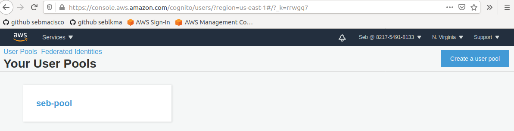
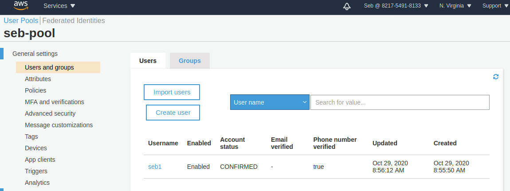
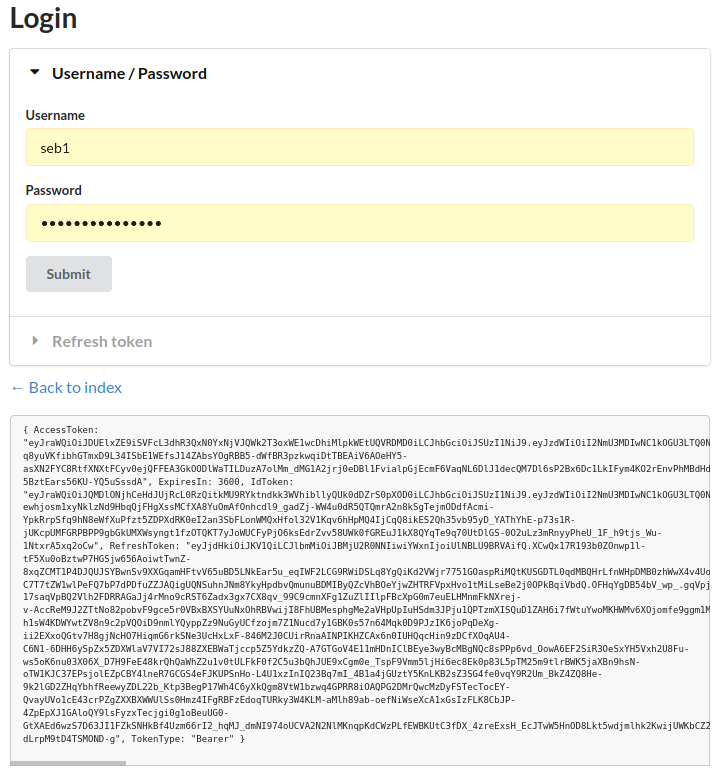

# Using JWT

This project provides a basic introduction to using JSON Web Token(JWT) in your application.  

## JWT Background

For a basic understanding of JWT, please visit this [JWT intro](https://jwt.io/introduction/).  

Good general articles on JWT can be found in:
[When and how to authenticate using JWT](https://blog.logrocket.com/jwt-authentication-best-practices/)  
[The Ultimate Guide to handling JWTs on frontend clients](https://hasura.io/blog/best-practices-of-using-jwt-with-graphql/)  

## Using AWS Cognito

To use AWS Cognito, you must have an IAM account.  

Sign in to AWS Console:  
https://console.aws.amazon.com/console/home?nc2=h_ct&src=header-signin


### AWS Profile

To use AWS APIs, you must have an AWS Profile.
To create an AWS Profile, visit:  

https://docs.aws.amazon.com/sdk-for-java/v1/developer-guide/credentials.html  
https://console.aws.amazon.com/iam/home?region=ap-southeast-1#/users/Seb?section=security_credentials  
https://docs.aws.amazon.com/IAM/latest/UserGuide/id_credentials_access-keys.html?icmpid=docs_iam_console  


### Access Key ID and Secret Key

Copy the Access Key ID and Secret Key from your AWS Profile to your Linux home AWS directory.  

Example, the AWS configuration and credential file in AWS hidden directory, has the config name `sebaws`:  
```sh
iox@ubuntu:~$ cat .aws/configuration 
[sebaws]
aws_access_key_id = ...
aws_secret_access_key = ...
```

```sh
iox@ubuntu:~$ cat .aws/credentials 
[sebaws]
aws_access_key_id = ...
aws_secret_access_key = ...
```

Add to your .profile:
```sh
export AWS_PROFILE="sebaws"
```

and reload
```sh
$ source .profile
```

## Go example AWS Cognito

There is a [sample Go application using AWS Cognito](https://github.com/br4in3x/golang-cognito-example).  
We have cloned it in

Before we can run the sample application, we have to create a User Pool and Client App in AWS Cognito.  

Sign in to AWS Console, from Services, select Cognito and create a User Pool to use for your application.  

Ensure the User Pool region used in your codes is the same as the region created for the User Pool in AWS.  

Example Go code:  
```go
func main() {
    conf := &aws.Config{Region: aws.String("us-east-1")}
    ...
```

AWS > Services > User Pools > **N.Virginia**  


### AWS Cognito User Pool Settings

Pool Id: us-east-1_250mTEnIN  
App Client: seb-app-2  
App Client Id: 5o9hnphuo313qt8qhflal8cj3m  

In ***MFA and Verification***:  

For `Do you want to enable Multi-Factor Authentication (MFA)?`  
  select **Optional**.  

For `Which second factors do you want to enable?`  
  Check `SMS text message`  
  **Uncheck** `Time-based One-time Password`

For `Which attributes do you want to verify?`  
  select `Email or phone number`  

For `You must provide a role to allow Amazon Cognito to send SMS messages`  
  click to create `New role name`  

In ***Client Apps***:
See `seb-app-2`.

For `App client secret`  
  ensure **(no secret key)** 
  check `Enable username password based authentication (ALLOW_USER_PASSWORD_AUTH)`  

### Running the sample Go application

Follow the instructions describe in the sample Go application README.  

Build  
```sh
$ go build -o ./build/cognito
go: downloading github.com/aws/aws-sdk-go v1.31.14
go: extracting github.com/aws/aws-sdk-go v1.31.14
go: downloading github.com/jmespath/go-jmespath v0.3.0
go: extracting github.com/jmespath/go-jmespath v0.3.0
go: finding github.com/aws/aws-sdk-go v1.31.14
go: finding github.com/jmespath/go-jmespath v0.3.0
```
Run  
```sh
$ AWS_PROFILE=sebaws COGNITO_APP_CLIENT_ID=5o9hnphuo313qt8qhflal8cj3m COGNITO_USER_POOL_ID=us-east-1_250mTEnIN PORT=8080 ./build/cognito
```

Using Firefox, open http://localhost:8080/  

We have registered a User "seb1", and have successfully created the user in AWS Cognito User Pool.  

username: seb1  
password: seb1Seb!

  

You can now click Login, which redirects you to http://localhost:8080/login  

  
