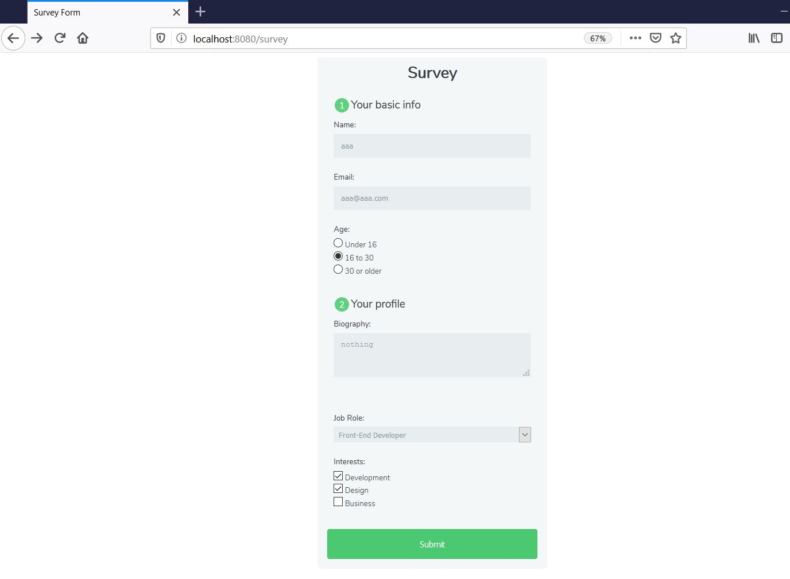

# A lite web app using Go programmimg language

This project uses Go programmimg language as a lite development and deployment platform for your web application.

## Pre-requisites

For development:  
- Go environment (uses Go HTML Templates) 
- SQLITE (to persist data)

For deployment:  
- Go binary `survey`  
- the html files from `templates/*`  
- the database file `survey.db`  

Linux:  
```sh
$ ./survey survey.db
2020/07/13 03:03:52 Listening at 8080
```

Windows 10:  
```sh
surveywin.exe survey.db
2020/07/13 19:05:26 Listening at 8080
```

You can then access the survey form using your web browser:  


## Cross compiling for Mac OSX

```sh
GOOS=darwin GOARCH=amd64 go build -o surveymac survey.go
```

## Cross compiling for Windows

Simply compiling for Windows will not do for sqlite3.  
That is, `GOOS=windows GOARCH=amd64 go build -o surveywin.exe survey.go` is not sufficient. It will result in runtime error:  
```sh
2020/07/13 17:32:48 http: panic serving [::1]:26616: Binary was compiled with 'CGO_ENABLED=0', go-sqlite3 requires cgo to work. This is a stub
goroutine 19 [running]:
net/http.(*conn).serve.func1(0xc000148000)
        /usr/local/go/src/net/http/server.go:1767 +0x140
panic(0x77d5a0, 0xc0000e01e0)
        /usr/local/go/src/runtime/panic.go:679 +0x1c0
```

In order to build a standalone Go binary with sqlite3, your build environment will need to install the mingw libraries:  
```sh
sudo apt-get install gcc-mingw-w64-i686
```
```sh
sudo apt-get install gcc-mingw-w64-x86-64
```

The build command need to switch the C and C++ to mingw accordingly:  
```sh
CGO_ENABLED=1 CC=x86_64-w64-mingw32-gcc CXX=x86_64-w64-mingw32-g++ GOOS=windows GOARCH=amd64 go build -o surveywin.exe survey.go
```

